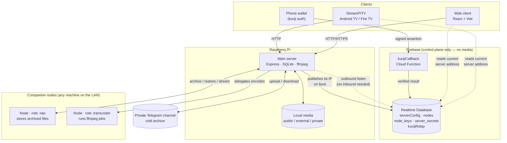

# StreamPi

A self-hosted media server built for a Raspberry Pi on a home connection with a **dynamic IP
behind NAT**, where storage runs out long before the library stops growing.

Those two constraints shape almost every design decision here. The server never needs a stable
inbound address — clients discover its current one through Firebase Realtime Database, and the
one genuinely public endpoint (wallet auth) is a Cloud Function that the server *reads from*
rather than receives requests on. And local disk is treated as a cache, not the library: media
tiers outward onto companion NAS nodes and into a private Telegram channel as space runs low,
then streams back on demand.

---

## Architecture



| Component | Path | Stack |
|---|---|---|
| Main server | [server/](server/) | Node ESM, Express 4, better-sqlite3, fluent-ffmpeg, GramJS |
| Companion node | [node/](node/) | Node ESM, Express, multer — one binary, two opt-in roles |
| Web client | [web_client/](web_client/) | React 18, Vite, Tailwind, lucide-react |
| Android TV client | [StreamPiTV/](StreamPiTV/) | Kotlin, Jetpack Compose for TV, Gradle |
| Wallet-auth relay | [functions/](functions/) | Firebase Functions v2, codebase `kunji-relay` |
| Hosting redirect | [fb_redirect/](fb_redirect/) | Firebase Hosting |

### Why Firebase is in the picture

It holds no media and serves no traffic. It exists to solve addressing and identity:

- **`serverConfig`** — the server writes its current `http://<ip>:<port>` here on every boot
  ([firebaseBootstrap.js](server/src/firebaseBootstrap.js)). This is the one RTDB path readable
  without auth, because a client needs it *before* it has any credential. Everything else is
  deny-by-default in [database.rules.json](database.rules.json).
- **`nodes` / `node_keys`** — companion nodes self-register with a hashed API key. Write access
  is gated on the hash matching and the key not being revoked, enforced in the rules themselves.
- **`server_secrets`** — runtime secrets, Admin-SDK-only. See the precedence warning below.
- **`kunjiRelay`** — a phone wallet POSTs a signed assertion to the public `kunjiCallback`
  Function, which verifies it *at the edge* and writes the outcome here. The main server
  subscribes outbound (`ref.on('value')`), so it never needs an inbound public endpoint and its
  dynamic IP stays irrelevant.

---

## How media moves

Storage is tiered, and files move between tiers automatically as the Pi fills up.

1. **Local** — [`MEDIA_ROOT`](server/src/paths.js) for the shared library, plus an `External`
   root for attached drives and a `Private` root for per-user private items.
2. **NAS nodes** — [autoArchiver.js](server/src/autoArchiver.js) watches free space and, below
   `MIN_FREE_SPACE_BYTES` (30 GB), offloads the best candidate to the healthiest node with the
   `nas` role. Archived items are recorded as `nas://<nodeId>/<filename>` and resolved back to a
   real HTTP URL by [nasSource.js](server/src/nasSource.js), which refuses (503) up front if the
   owning node is unregistered *or* merely unreachable.
3. **Telegram** — a private channel acts as cold storage via GramJS
   ([telegramService.js](server/src/telegramService.js)).

Restores and streams both read straight off the node over HTTP range requests, so an archived
file is playable without being pulled back to the Pi first. The node applies **two separate
concurrency gates** ([node/routes/nas.js](node/routes/nas.js)): writes are bounded by
`maxConcurrentNasJobs` (default 1, since an archive is a long heavy transfer), reads by
`maxConcurrentFileReads` (default 12, because one `<video>` element opens several parallel range
requests and sharing the write gate made archived files unplayable in a browser).

Live archive/restore progress is polled from `/api/nas/jobs` and overlaid on the poster; the
in-flight filename is persisted to `localStorage` so a page refresh mid-transfer resumes
tracking instead of losing it ([useLibraryActions.js](web_client/src/utils/useLibraryActions.js)).

### Transcoding

[streaming.js](server/src/routes/streaming.js) prefers **direct play**, probing the file and
streaming it untouched when the client can handle it. When it can't, the copy-vs-encode decision
is made per stream and per track — video is frequently already compatible even when a stray
default AC3 track forces the audio to be re-encoded, so the video stream is copied rather than
blindly re-encoded.

Heavier jobs are delegated. [transcodeQueue.js](server/src/transcodeQueue.js) polls every 30s for
a node with the `transcoder` role that is reachable and idle, and hands off the job; the Pi only
encodes locally when nothing better is available.

### Authentication

Two independent paths, both issuing the same session token:

- **Local accounts** — pbkdf2-SHA512, 100k iterations, per-user random salt
  ([cryptoHelpers.js](server/src/cryptoHelpers.js)). Accounts predating per-user salts are
  migrated lazily on their next successful login. Login is rate-limited per IP, in memory.
- **Kunji wallet** — the phone signs a challenge; the Cloud Function verifies it and relays the
  result through RTDB as described above.

---

## Configuration

**All configuration lives in `.env` files. Nothing with a real credential in it is tracked.**

| File | Tracked? | Purpose |
|---|---|---|
| `server/.env` | **No** | Main server settings + Telegram secrets |
| `server/.env.example` | Yes | Template with every key documented |
| `server/service-account.json` | **No** | Firebase Admin credentials |
| `node/node_config.json` | **No** | A node's id/apiKey/roles/storage |
| `node/node_config.json.example` | Yes | Template |

```bash
cd server && cp .env.example .env && $EDITOR .env
```

The format is flat `KEY=VALUE`, parsed by [server/src/env.js](server/src/env.js) — a ~25-line
reader rather than the `dotenv` package, because the Pi can't always take a fresh
`npm install` and flat key/value parsing doesn't justify a runtime dependency. Real environment
variables override the file, so pm2 or systemd can inject a value without editing it. Quotes are
optional and stripped when matched; `#` only starts a comment at the beginning of a line, so a
value containing `#` is safe.

> **⚠️ Firebase overrides `.env` for Telegram secrets.**
> `initSecretsManager()` seeds RTDB `server_secrets` from `.env` **only when that node does not
> yet exist**. On every later boot it merges the stored values *over* the file. Editing `.env`
> alone is therefore a no-op once the node exists — rotating a Telegram credential means
> updating `server_secrets` too. See [config.js](server/src/config.js).

### Why the node keeps JSON instead of `.env`

[node/node_config.json](node/node_config.json.example) stays JSON deliberately. It is not a
secrets file that gets read once at boot — it is **mutable state the node writes back to**, edited
live from the node-owner UI via `POST /api/config` with no restart, and it holds a nested
`nasStorageLocations` array. Flat `KEY=VALUE` can express neither the nesting nor the write-back.
It was already gitignored and never leaked.

---

## Setup

Prerequisites: Node 18+, `ffmpeg` on PATH, and a Firebase project with Realtime Database.

### Main server (on the Pi)

```bash
cd server
npm install
cp .env.example .env            # then fill in — see Configuration above
# place your Firebase Admin key at server/service-account.json
node gen_session.js             # interactive Telegram login → prints TG_SESSION
npm start                       # foreground — see Operations for running it under pm2
```

Serves HTTP on `PORT` (3005) and, when
`server_data/StreamMedia/.stream_db/server.{key,cert}` exist, HTTPS on `HTTPS_PORT` (3006). The
built web client is served from `web_client/dist`, so build that first for a single-origin
deployment.

### Companion node (any machine on the LAN)

```bash
cd node
npm install
cp node_config.json.example node_config.json
```

Create the node in the admin dashboard first — it issues the `id` and `apiKey` to paste in. Roles are
set here, not there: `["nas"]` for a box with disks, `["transcoder"]` for one with CPU to spare, both
if it has both. The node refuses to boot without at least one, and what it reports here is what the
server dispatches on. Then `npm start`, or put it under pm2 as below.

Ownership is separate from creation, and is what lets a non-admin manage their own machine. Open the
node's own dashboard on its `port` and sign in with your StreamPi account: if that account isn't the
node's owner it asks for the `apiKey`, which claims an unowned node and otherwise reports who holds it.
Admins bypass the check entirely, so they never see that screen. An admin can also assign or clear the
owner from web Settings → Nodes — note that clearing alone doesn't revoke access, since a past owner
keeps a copy of the key, which is why that dialog offers to regenerate it too.

Three optional fields are worth knowing about:

- **`encoder`** — `"auto"` (the default), `"libx264"`, or a specific hardware encoder such as
  `"h264_vaapi"`. Detection is a one-shot probe at boot, and on some machines its result depends on
  things outside the process: VAAPI access is often granted by a logind ACL, so an otherwise identical
  box answers differently depending on whether anyone is signed in at the console. A pin makes the
  encoder a decision rather than a discovery. It is still probed at boot, so a pin that cannot work is
  reported then rather than failing every job.
- **`workDir`** — where download → transcode → upload jobs stage their files. Defaults to
  `node/transcoder_work` inside the checkout, which is often on the smallest filesystem a machine has;
  a job holds the input and the output at the same time, so budget roughly twice the largest source.
- **`publicUrl`** — the address the *server* should use to reach this node, when that isn't simply the
  node's own IP and port. Needed wherever a node can dial out but nothing can dial in: a NAT with no
  port forward, or a network that filters inbound. Set it and the node stops advertising a direct
  address altogether, so the server goes straight to this URL instead of waiting out a 2-second
  timeout on one that cannot work.

  For a reverse SSH tunnel the node's side establishes — `ssh -N -R 127.0.0.1:14500:127.0.0.1:4500
  server-host` — that value is `http://127.0.0.1:14500`, since the URL is resolved *on the server*.
  Every server→node path keys off it, health checks and archive transfers and playback of archived
  media alike, so one tunnel covers all of them. Restrict the key on the server side to
  `restrict,port-forwarding,permitlisten="127.0.0.1:14500"` — it then cannot open a shell or forward
  anything else — and run the tunnel under a supervisor with `ExitOnForwardFailure=yes` and
  `ServerAliveInterval`, so a half-dead SSH session that tunnels nothing gets replaced instead of
  looking like a node that is down.

  Note the node→server direction still goes direct, so the node needs to reach the server's own
  address either way.

On hardware acceleration: VAAPI on an Intel iGPU measured *slower* than `libx264 -preset ultrafast` on
a 20-core CPU here, but produced output less than half the size. For a node that uploads every result
back over the network, or has a fixed storage budget, bitrate is usually the thing worth optimising —
not encode speed.

[scripts/build-worker-dist.sh](scripts/build-worker-dist.sh) packages a distributable copy with the
template config, never the live one.

### Web client

```bash
cd web_client
npm install
npm run dev      # dev server, --host so other devices on the LAN can reach it
npm run build    # → dist/, which the main server serves
```

### Cloud Function

```bash
firebase deploy --only functions:kunji-relay,database
```

Deploy `kunjiCallback` under its **own least-privileged service account**, not the project
default. Admin SDK access bypasses security rules entirely, so the default account would give a
public wallet-facing endpoint blast-radius access to `node_keys` and `server_secrets`.

### Android TV client

Built from a desktop, not the Pi:

```bash
cd StreamPiTV
./gradlew assembleRelease      # ./deploy-apk.sh pushes to a device
```

Signing config comes from `keystore.properties` / a `.jks` file, both gitignored.

---

## Tests

```bash
cd server     && npm test     # vitest — nasSource, nodeClaim, nodeProxy, transcodeQueue
cd node       && npm test     # vitest — concurrencyGate, migration, retry, storage
cd web_client && npm test     # vitest — components + utils
cd StreamPiTV && ./gradlew test
```

## Operations

Both the server and each companion node are long-running processes, so both belong under pm2. Set up
once per machine — `pm2 startup` installs the boot hook, and `pm2 save` writes the process list that
hook replays, so skipping the save means nothing comes back after a reboot:

```bash
pm2 startup                                              # once per machine; prints a root command to run
cd server && pm2 start server.js --name streampi      && pm2 save
cd node   && pm2 start index.js  --name streampi-node && pm2 save
```

A node runs on whichever machine hosts it, so it registers with that machine's pm2. On a single-box
setup that is the same pm2 as the server's and `pm2 list` shows both; on a separate box, the node's
commands run there.

```bash
pm2 list                            # what is managed here, and whether it is up
pm2 logs streampi                   # tail server logs   (streampi-node for a node)
pm2 restart streampi                # or: pm2 restart streampi-node
pm2 stop streampi
pm2 delete streampi && pm2 save     # remove from startup
```

**Restart a node with `pm2 restart streampi-node`, not the dashboard's own Save & Restart button.**
That button spawns a detached replacement and exits ([node/routes/core.js](node/routes/core.js)), and
pm2 reads the exit as a crash worth restarting — leaving two processes contending for port 4500, one
of them dying on `EADDRINUSE`. The button exists for a node started by hand with `npm start`.

The server installs `unhandledRejection` / `uncaughtException` handlers on purpose: Node's
default is to kill the process, which would drop every connected viewer's stream over a bug three
files away. They log and keep serving.

---

## Security notes

- **The repo is public.** Assume anything committed here is permanently public, even after a
  force-push — GitHub keeps unreachable commits addressable by SHA, and public pushes are
  mirrored by third-party archives within minutes.
- **`TG_SESSION` is the crown jewel.** A GramJS StringSession is an *already authorized* login:
  it needs no phone code and no 2FA challenge, because 2FA only gates new logins. If it leaks,
  revoke it immediately at Telegram → Settings → Devices → Terminate Session, then regenerate
  with `gen_session.js`. Rotating the file without terminating the session changes nothing.
- **`web_client/public/firebase_config.json` is not a secret.** A Firebase web `apiKey` is a
  project identifier that ships in every browser. What protects the data is
  [database.rules.json](database.rules.json) plus auth — review those, not the key.
- **`web_client/public/streampi-local-ca.pem` is public by design** — it's the CA certificate
  clients need to trust the LAN HTTPS listener, which is why it's the one `*.pem` exempted in
  [.gitignore](.gitignore).
- **Turn on GitHub secret-scanning push protection.** It refuses the push instead of telling you
  afterward, which is the only version of this that actually helps.
